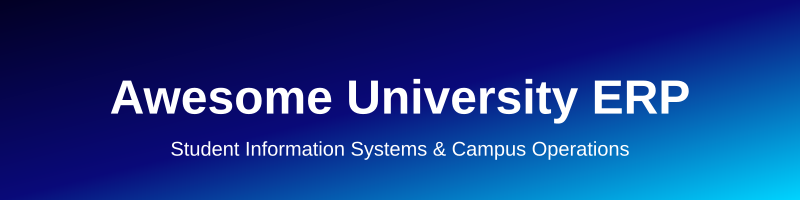

  

# 🎓 Awesome-University-ERP 🏫

## 🌟 Top University ERP Platforms Ecosystem 🚀

**Curated List of SaaS Products & Open-Source GitHub Projects** 📚

*Focused on Student Information Systems (SIS), Higher Education ERP, Academic Administration, Enrollment, Finance & Campus Operations* 🎓

**Last updated: August 2026** 📅

This repository tracks notable **SaaS platforms** ☁️ and **open-source projects** 🛠️ for **University ERP / Student Information Systems**. These tools manage the full student lifecycle — admissions, registration, academic records, financial aid, billing, scheduling, advising, and institutional administration — for colleges and universities.

**Examples** include Ellucian Banner, Ellucian Colleague, Anthology Student, Jenzabar, CampusNexus, Workday Student, Oracle Student Cloud, Unit4 Student Management, CAMS Enterprise, Populi, Oracle PeopleSoft Campus Solutions, Jenzabar ONE, Campus Management Corp, Academia ERP, Classe365, and openSIS (the category leaders).

**Open-source emphasis**: This section is heavily expanded with every major active project for student information systems, educational ERPs, and open campus management platforms — ideal for universities, colleges, and institutions seeking data ownership, lower costs, and customizable alternatives to proprietary higher-ed ERPs.

Contributions welcome! 🤝 Open a PR to add/update entries. Keep descriptions factual and link to official sites.

## 📑 Table of Contents

- [SaaS/Hosted Platforms](#saas-hosted-platforms)
- [Open-Source GitHub Projects](#open-source-github-projects)
- [How to Contribute](#how-to-contribute)
- [Disclaimer](#disclaimer)

## ☁️ SaaS/Hosted Platforms

| Platform | Description | Pricing | Free Tier Limit | Company Size (Revenue/Valuation) |
|----------|-------------|---------|-----------------|----------------------------------|
| **[Oracle Student Cloud / PeopleSoft Campus Solutions](https://www.oracle.com/industries/higher-education/)** | Mature Campus Solutions and newer Oracle Cloud Student offerings for large public institutions and complex higher-education environments. | Custom Quote | None | $52B+ |
| **[Workday Student](https://www.workday.com/en-us/products/student.html)** | Cloud-native student system tightly integrated with Workday Finance and HCM, aimed at institutions seeking a unified enterprise platform. | Custom Quote | None | $7.3B+ |
| **[Ellucian Banner](https://www.ellucian.com/solutions/ellucian-banner)** | Flagship higher-education ERP and SIS for large universities, covering student, finance, HR, and financial aid with deep functional breadth and a large partner ecosystem. | Custom Quote | None | $1.2B+ |
| **[Ellucian Colleague](https://www.ellucian.com/solutions/ellucian-colleague)** | Integrated ERP/SIS designed for small-to-midsize colleges and community colleges, focusing on student lifecycle and administrative efficiency. | Custom Quote | None | $1.2B+ |
| **[Anthology Student](https://www.anthology.com/)** | Modern student information and engagement platform (evolved from Campus Management and related products) supporting the full learner lifecycle. | Custom Quote | None | $800M+ |
| **[CampusNexus](https://www.campusmanagement.com/)** | Student information and campus management solution historically focused on career colleges and specialized institutions (now part of broader Anthology ecosystem). | Custom Quote | None | $800M+ |
| **[Unit4 Student Management](https://www.unit4.com/)** | People-centric ERP and student management solution popular in education and non-profit sectors, with strong fund accounting capabilities. | Custom Quote | None | $400M+ |
| **[Jenzabar / Jenzabar ONE](https://www.jenzabar.com/)** | Higher-education platform tailored for small-to-midsize private colleges, combining SIS, CRM, retention tools, and administrative functions. | Custom Quote | None | $150M+ |
| **[Populi](https://www.populi.co/)** | Cloud-based student information and campus management system designed for smaller colleges and seminaries with an emphasis on ease of use. | Volume-based | None | $10M+ |
| **[CAMS Enterprise](https://www.three-rivers.com/)** | Comprehensive student information system used by many private colleges and universities for academic and administrative operations. | Custom Quote | None | $10M+ |
| **[Academia ERP](https://www.serosoft.com/)** | Higher-education ERP covering admissions, academics, examinations, finance, and campus administration. | Custom Quote | None | $5M+ |
| **[Classe365](https://www.classe365.com/)** | Cloud student information and learning management platform used by schools, colleges, and training institutions. | Per student/module based | None | $5M+ |

## 🛠️ Open-Source GitHub Projects

- **[Odoo Education Modules](https://github.com/odoo/odoo)** 

  Community and enterprise education-related modules within the broader open-source Odoo ERP ecosystem that can be extended for higher education.

- **[Moodle](https://github.com/moodle/moodle)** 

  While primarily an LMS, Moodle’s ecosystem and plugins often integrate with or extend open SIS platforms for complete campus solutions.

- **[Canvas LMS](https://github.com/instructure/canvas-lms)** 

  Open-source LMS that serves as a core part of many university ecosystems.

- **[Frappe Education / ERPNext Education](https://github.com/frappe/education)** 

  Open-source education management system built on the ERPNext/Frappe framework, covering student lifecycle, fees, scheduling, exams, and portals.

- **[Gibbon](https://github.com/GibbonEdu/core)** 

  Flexible open-source school management platform covering student information, scheduling, attendance, assessment, and administrative workflows.

- **[RosarioSIS](https://github.com/francoisjacquet/rosariosis)** 

  Full-featured open-source Student Information System for school and higher-education management, including gradebooks, attendance, scheduling, billing, and parent/student portals.

- **[OpenEduCat](https://github.com/openeducat/openeducat_erp)** 

  Comprehensive open-source Educational ERP built on Odoo, designed for universities and institutes with modules for admissions, academics, finance, and HR.

- **[Fedena](https://github.com/projectfedena/fedena)** 

  Open-source school management software (historical but still referenced) covering student, academic, and administrative functions.

- **[openSIS](https://github.com/OS4ED/openSIS-Classic)** 

  Mature, commercial-grade open-source Student Information System supporting student records, scheduling, attendance, grades, transcripts, and multi-institution deployments.

- **[AlekSIS](https://github.com/AlekSIS-org/AlekSIS-Core)** 

  Modern open-source school information system focused on flexibility, privacy, and European educational requirements.

### 💡 Additional Strong Open-Source Options

- **Educational ERPs**: OpenEduCat (Odoo-based) and Frappe/ERPNext Education for full administrative + academic coverage.
- **Lightweight SIS**: RosarioSIS, Gibbon, and openSIS for focused student information management.
- **Frameworks**: Odoo and Frappe/ERPNext as extensible bases for custom university ERPs.
- **Supporting tools**: Open-source library systems (Koha), learning analytics, and enrollment portals that complement SIS platforms.
- Many regional and institution-specific open-source SIS forks and academic management projects on GitHub.

**Frameworks for building custom systems**: Combine **openSIS or RosarioSIS** for core student records, **OpenEduCat or Frappe Education** for broader ERP functionality, open LMS platforms (Moodle), and custom modules on Odoo/Frappe to create a complete self-hosted university ERP and student information system.

## 🤝 How to Contribute

1. Fork the repo.
2. Add/edit entries in `README.md` (follow existing format).
3. Include: name, link, 1–2 sentence description, and whether it's SaaS or open-source.
4. Submit PR with a short explanation.

Star the repo if you find it useful! ⭐

## ⚠️ Disclaimer

- This is a **community-curated** list — not exhaustive and not an endorsement.
- University ERP and SIS platforms handle sensitive student data and must comply with regulations such as FERPA, GDPR, and institutional data governance policies.
- Self-hosted open-source solutions require proper security, accessibility, backup strategies, and ongoing maintenance for production use in higher education.

## 📈 Star History

<a href="https://star-history.com/#ishandutta2007/Awesome-University-ERP&Date">
 <picture>
   <source media="(prefers-color-scheme: dark)" srcset="https://api.star-history.com/svg?repos=ishandutta2007/Awesome-University-ERP&type=Date&theme=dark" />
   <source media="(prefers-color-scheme: light)" srcset="https://api.star-history.com/svg?repos=ishandutta2007/Awesome-University-ERP&type=Date" />
   
 </picture>
</a>

---

**Made for higher-education IT leaders, registrars, administrators, and developers building open campus systems.** 🎓
Let's make university ERP and student information management more open, affordable, and institution-controlled. 🌍
